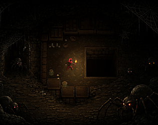

# Hush

  

## Overview

Hush is a 2D horror-stealth game where every movement is a risk calculation. You navigate dark, interconnected rooms, collect three keys, and escape — while spiders and crawlers hunt you based on the noise you make and the light you carry.

The game is built in Unity with a top-down perspective. The camera angle was a deliberate choice: top-down gives you enough spatial awareness to plan routes and read patrol lanes, which is critical when stealth depends on sound and light rather than line-of-sight hiding.

[Play it here.](https://swordandtea.itch.io/hush)

## Enemies

There are two enemy types, and they work together in a way that compounds mistakes.

> **Spiders** are pressure enemies. They detect you through sound (your footsteps when running) and through light proximity. When a spider spots you, it chases and fires web projectiles that temporarily freeze your movement. A spider will deal damage but won't kill you outright on contact; it actually destroys itself if it touches you. The real danger is what happens next: you're slowed, exposed, and loud.

> **Crawlers** are the finishers. They patrol until they detect you (primarily through light), then commit to a chase. If a crawler reaches grab range, it locks your input and deals lethal damage. There is no surviving a grab. Crawlers are the reason you care about spiders.

Both enemy types use behavior trees (Behavior Designer) for decision-making and A* Pathfinding for navigation. They patrol by generating two random points within a radius, rejecting any that overlap walls, and alternate between them. When they detect you, they switch to pursuit. The transitions are deterministic and readable, which matters: if enemies felt random, you couldn't learn from deaths.

## Mechanics

- **Movement** has two modes: walk and run. Walking is slow but quiet. Running is fast but your footsteps become an audio source that enemies can hear across distance. There's no crouch, no dash, no special traversal. The entire stealth system lives in this one tradeoff.

- **Noise** is computed per-enemy. Each spider has a hearing check that reads your footstep audio source, calculates distance attenuation (linear or logarithmic rolloff between min/max range), multiplies by source volume, and compares against a hearing threshold. If the perceived volume exceeds the threshold, the enemy gets your position.

- **Light detection** works through URP 2D point lights. Enemies check whether you're within a light's radius and cone angle. Your character carries a small torch that only illuminates a tight radius around you, enough to see immediate surroundings, but not enough to plan far ahead.

- **Web traps** are spider projectiles. They travel in a straight line until hitting a wall or you. On hit, your movement locks for a duration and your character plays a health loss animation. During this window, you're stationary. Better hope there's no crawlers nearby.

- **Health** is intentionally small (3 HP). Spider contact deals minor damage and destroys the spider. Crawler grabs deal 100 damage, ending your run instantly.

## Goal

Find all three keys scattered across the level and reach the exit staircase. The keys are color-coded (silver, gold, grey) and placed in different areas of the map. The exit zone checks your key count; if you haven't collected all three, it tells you how many you're missing.

The level is a single large tilemap divided into corridors, rooms, and bottleneck connectors. Learning the map is most of the challenge, especially when you've got swarms of spiders and crawlers around you.

## Assets and Tools

- **Engine:** Unity 6000.3.10f1 with Universal Render Pipeline (URP) for 2D lighting.

- **AI:** [Behavior Designer](https://opsive.com/support/documentation/behavior-designer/) for enemy behavior trees. [A* Pathfinding Project](https://arongranberg.com/astar/documentation/stable/) (v5.4.6) for navigation.

- **Camera:** Cinemachine 3.1.6 for smooth player-following camera.

- **Input:** Unity Input System with actions for Move, Sprint, and Exit.

- **UI:** Built entirely with UI Toolkit (UXML/USS), including HUD, pause menu, health bar, start menu, game over screen, and a story/tutorial intro overlay.

- **Art:** Environment tiles from [Rogue Fantasy Catacombs](https://szadiart.itch.io/rogue-fantasy-catacombs) by Szadi Art. Character sprites from [Cave Explorer](https://samuellee.itch.io/cave-explorer-animated-pixel-art) by Samuel Lee. Key sprites from [Pixel Art Key Pack](https://karsiori.itch.io/pixel-art-key-pack-animated) by Karsiori. Select sprite work generated with [PixelLab](https://www.pixellab.ai/) for style-consistent variants. UI composition and HUD layout done in-house.

- **Other packages:** Feel/MMFeedbacks, DOTween, Unity 2D Tilemap tooling, Aseprite/PSD importers.

## Contributions

Game Co-Creator: [Wei Xiang](https://swordandtea.com).
